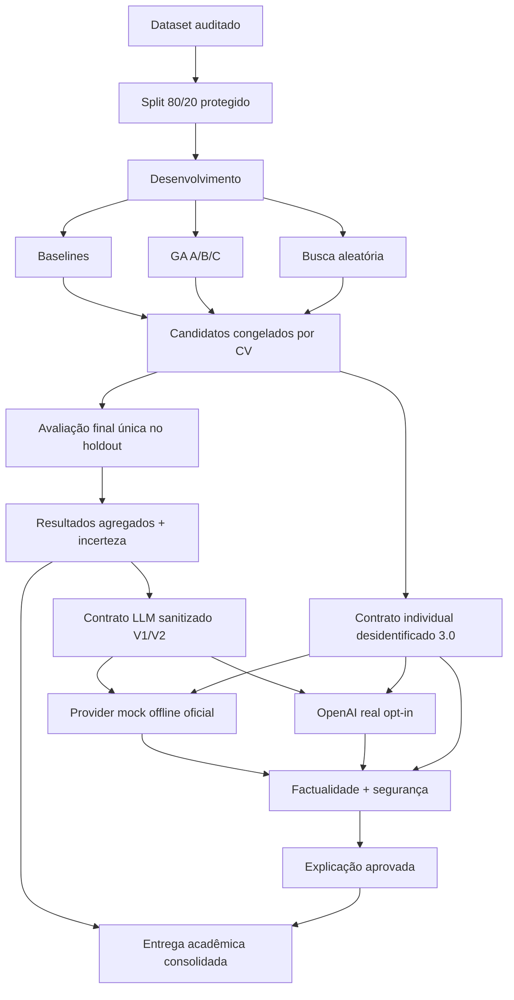

# Tech Challenge — Fase 2 — Algoritmo Genético e LLM

[](https://github.com/rafaelbarrosleite/fiap-techchallenge-fase2-ga-llm/actions/workflows/ci.yml)

Projeto acadêmico da Pós Tech FIAP que otimiza Regressão Logística, Random Forest e KNN com um algoritmo genético autoral e transforma resultados agregados e classificações individuais desidentificadas em explicações controladas por uma camada LLM segura.

O projeto está consolidado para reprodução e demonstração offline. Não oferece diagnóstico, tratamento ou recomendação médica.

🎥 **Vídeo de demonstração:** https://youtu.be/9obBNc1XHmg

Estado da entrega: código, evidências, documentação, publicação técnica e vídeo de demonstração concluídos.

## Objetivo e resultado

A seleção ocorreu somente em 455 registros de desenvolvimento, usando cinco dobras estratificadas. Os candidatos foram congelados antes do holdout de 114 registros. O teste final não alterou hiperparâmetros, threshold ou modelo selecionado.

| Família | Recall baseline | Recall GA | FN baseline→GA | Resultado confirmatório |
|---|---:|---:|---:|---|
| Regressão Logística | 0,928571 | 0,976190 | 3→1 | ganho observado |
| Random Forest | 0,904762 | 0,928571 | 4→3 | ganho observado, com AUC menor |
| KNN | 0,904762 | 0,904762 | 4→4 | ganho de CV não confirmado |

Os intervalos permanecem amplos porque o holdout contém apenas 42 casos malignos. Não há evidência suficiente para afirmar superioridade estatística universal ou validade clínica.

## Arquitetura



## Instalação

Requisitos: Python 3.11–3.13 e [uv](https://docs.astral.sh/uv/).

```bash
uv sync
```

O dataset local e as dependências estão identificados por hashes/lock. Segredos não são necessários para a demonstração oficial.

## Reprodução segura da entrega

```bash
uv run pytest
uv run validate-deliverable
uv run run-final-evaluation
uv run evaluate-llm-output
```

Com os manifestos íntegros e status `completed`:

- `run-final-evaluation` apenas valida e carrega resultados existentes;
- `evaluate-llm-output` recalcula as verificações determinísticas da execução mock congelada;
- `validate-deliverable` é somente leitura.

Estado validado da entrega em clone limpo: **230 testes aprovados**. Os avisos observados são de depreciação interna de `pyparsing`/Matplotlib e não representam falha funcional ou alteração de resultado.

`run-llm-evaluation` não faz parte do fluxo oficial. A identidade da execução mock V1 inclui a assinatura do código que a produziu, e a adição posterior do contrato V2 ao pacote `llm/` alterou essa assinatura. O engine então se recusa a reaproveitar o artefato congelado e levanta `ManualInterventionRequired`. Esse é o comportamento pretendido: a salvaguarda existe para impedir que uma execução congelada seja silenciosamente sobrescrita depois que o código muda. A evidência não foi re-selada para contornar a verificação; consulte [docs/limitacoes_e_validade.md](docs/limitacoes_e_validade.md).

Não execute os comandos históricos de GA, busca ou baseline durante a demonstração. Eles permanecem no projeto para reprodução metodológica deliberada, não fazem parte do fluxo oficial da Missão 6.

## Estrutura

```text
data/                                dataset auditado
docs/                                relatório, auditorias, métodos e demo
src/tech_challenge_fase2/
  genetic/                            genomas, fitness, operadores e engine
  llm/                                contratos, prompts, providers e checkers
  llm_v2/                             contrato semântico com pares explícitos
  llm_individual/                     explicação individual desidentificada
  serving/                            autoscaling, servidor congelado e monitoramento
  _historical/                        trilha preservada da integração real, fora do fluxo oficial
  final_evaluation.py                 avaliação confirmatória protegida
  deliverable.py                      consolidação somente leitura
tests/                                suíte automatizada
artifacts/
  official/                           nove experimentos A/B/C
  selection/                          candidatos congelados
  final_evaluation/                   resultados e incerteza
  llm_evaluation/                     entrada, saída e avaliações LLM
  llm_contract_v2/                    validação offline do contrato V2
  llm_evaluation_openai_v4/           execução real V2 preservada
  llm_individual_explanation/          explicação individual fake aprovada
  llm_individual_explanation_openai/   explicação individual OpenAI aprovada
  final_summary/                       tabela e manifesto da entrega
reports/figures/final_presentation/  figuras finais revisadas
```

## Metodologia resumida

O fitness do GA usa:

```text
0,60 × recall maligno médio
+ 0,25 × F1 maligno médio
+ 0,15 × ROC-AUC médio
− 0,10 × desvio-padrão do recall
```

Foram implementados população, torneio, crossover uniforme, mutação tipada, reparação, elitismo, cache, substituição, histórico, checkpoints, estagnação e seeds. Nove experimentos A/B/C realizaram 4.495 avaliações únicas e 22.475 fits em 51,12 minutos. A busca aleatória comparável levou 46,52 minutos.

O modelo para demonstração é a Regressão Logística da busca aleatória, vencedor global congelado antes do holdout. O teste final não reabriu essa decisão.

## Camada LLM segura

A LLM recebe somente resultados agregados. O contrato rejeita registros, features, índices, diagnósticos, previsões e probabilidades individuais. Prompts versionados impõem linguagem científica e disclaimer.

O provider oficial de reprodução continua sendo um mock determinístico offline. A resposta V1 foi aprovada por 139 checks factuais, safety checker e cinco dimensões. O contrato V2 acrescenta nove pares comparativos explícitos e 327 checks factuais.

Uma avaliação complementar real foi executada uma única vez com a OpenAI e o modelo configurado `gpt-5.5`, usando `store=false`, sem `temperature`, sem retry e sem dados individuais. A resposta passou schema, **327/327 fatos**, segurança, completude, clareza, pares e McNemar. O status científico permaneceu não aprovado porque três verificações lexicais de calibração exigiam frases específicas, embora o texto utilizasse formulações semanticamente seguras. Essa execução negativa foi preservada e não substitui o mock oficial.

### Explicação individual exigida pelo desafio

O contrato `3.0` explica uma classificação individual gerada pelo pipeline congelado de Regressão Logística. O caso demonstrativo vem somente do desenvolvimento e é convertido localmente em uma representação não reconstruível: classe/probabilidade, threshold e cinco sinais de influência. ID, índice, diagnóstico real, target e os 30 valores brutos não chegam à LLM.

A saída apresenta a classificação em linguagem natural, explica os cinco fatores, oferece insights acionáveis limitados a revisão humana e prepara campos fechados para texto desidentificado no Módulo 3. O fake e a execução real OpenAI foram aprovados em factualidade, completude, clareza, segurança, relevância médica e calibração científica; a execução real passou **40/40 checks factuais**.

```bash
uv run prepare-individual-explanation
uv run run-individual-explanation
uv run evaluate-individual-explanation
```

Consulte [docs/explicacao_individual_llm.md](docs/explicacao_individual_llm.md) e o [exemplo JSON versionado](docs/examples/individual_explanation_v1.json).

## Escalabilidade automática e monitoramento

A camada `serving/` executa o modelo congelado sob demanda variável. A política de dimensionamento é uma função pura do backlog, com histerese e cooldown; o servidor carrega o pipeline uma vez e confere o hash contra o manifesto assinado; o monitoramento grava eventos JSON Lines e recusa, na escrita, qualquer campo de identificação, alvo ou saída por registro.

```bash
uv run run-load-benchmark
uv run validate-scalability
```

Sob o mesmo perfil de vale, rajada e drenagem em 4 CPUs, o pool autoescalável reduziu a latência p95 de 131,6 ms para 74,6 ms e elevou a vazão de 177,7 para 301,9 req/s. Dois achados negativos foram preservados: o BLAS paraleliza internamente e mascarava o efeito das réplicas até ser fixado em uma thread por worker, e escalar réplicas só compensa acima de cerca de 2 ms de custo por pedido.

`Dockerfile`, `docker-compose.yml` e o módulo em `deploy/terraform/` cobrem a implantação opcional em nuvem, com piso e teto de réplicas espelhando a política local. A imagem é construída e o Terraform é formatado e validado a cada push no CI, então a configuração é verificada mesmo sem ser aplicada. A infraestrutura é acadêmica e **não foi provisionada**: nenhum recurso pago foi criado. Instruções em [deploy/README.md](deploy/README.md).

Detalhes em [docs/escalabilidade_e_monitoramento.md](docs/escalabilidade_e_monitoramento.md).

## Painel de resultados

Um documento HTML único e autocontido reúne os resultados, as respostas da LLM e a
verificação determinística de cada afirmação delas.

```bash
uv run build-dashboard
```

O painel é gerado a partir dos artefatos assinados e é estritamente somente leitura:
não treina, não reabre seleção, não altera o limiar, não carrega modelo e não faz
nenhuma chamada de rede — as figuras entram embutidas. Não existe campo de entrada
de dados: um formulário de paciente romperia a barreira de privacidade que o resto
do projeto sustenta.

O painel mais útil é o de verificação: cada número que a LLM afirmou aparece ao lado
do valor recalculado a partir do artefato congelado. A construção falha se o HTML
renderizado carregar qualquer marca de registro individual, e regerar o documento
produz bytes idênticos.

## Demonstração

- notebook somente leitura: [notebooks/demonstracao.ipynb](notebooks/demonstracao.ipynb);
- roteiro de 10–15 minutos: [docs/roteiro_apresentacao.md](docs/roteiro_apresentacao.md);
- guia completo e versão de 5 minutos: [docs/demo_guide.md](docs/demo_guide.md);
- resumo para leitura rápida: [docs/resumo_executivo.md](docs/resumo_executivo.md).

## Segurança metodológica

- split, folds, threshold e seeds congelados;
- seleção por CV antes do holdout;
- avaliação final idempotente;
- ausência de nova otimização ou inferência na consolidação;
- LLM agregada sem dados individuais e trilha individual com representação desidentificada, sem ID ou linha bruta;
- hashes e manifestos em todas as etapas críticas;
- divergências históricas preservadas.

## Limitações

- 569 registros e uma única fonte;
- apenas 42 malignos no holdout;
- ausência de validação externa, prospectiva e clínica;
- baseline histórico já havia registrado métricas do holdout, embora fora da linhagem de seleção;
- ICs amplos e testes pareados com poucos discordantes;
- uma seed oficial não mede variabilidade completa do GA;
- safety checker determinístico não cobre toda paráfrase;
- a única avaliação real é específica ao modelo e à versão retornada e não foi aprovada pelo gate lexical de calibração;
- regras textuais determinísticas ainda podem reprovar paráfrases semanticamente adequadas.

## Documentação

- relatório principal: [docs/relatorio_final.md](docs/relatorio_final.md);
- auditoria documental: [docs/auditoria_documental_final.md](docs/auditoria_documental_final.md);
- mapa de evidências: [docs/mapa_evidencias.md](docs/mapa_evidencias.md);
- rastreabilidade: [docs/matriz_rastreabilidade_final.md](docs/matriz_rastreabilidade_final.md);
- algoritmo genético: [docs/algoritmo_genetico.md](docs/algoritmo_genetico.md);
- avaliação final: [docs/avaliacao_final.md](docs/avaliacao_final.md);
- LLM segura: [docs/camada_llm_segura.md](docs/camada_llm_segura.md);
- contrato LLM V2: [docs/contrato_llm_v2.md](docs/contrato_llm_v2.md);
- avaliação OpenAI V2: [docs/avaliacao_provider_real_v4.md](docs/avaliacao_provider_real_v4.md);
- histórico da integração real: [docs/historico_integracao_llm_real.md](docs/historico_integracao_llm_real.md);
- explicação individual: [docs/explicacao_individual_llm.md](docs/explicacao_individual_llm.md);
- escalabilidade e monitoramento: [docs/escalabilidade_e_monitoramento.md](docs/escalabilidade_e_monitoramento.md);
- limitações: [docs/limitacoes_e_validade.md](docs/limitacoes_e_validade.md).

## Disclaimer acadêmico

Este resultado possui finalidade exclusivamente acadêmica e experimental. Os modelos avaliados não foram validados para uso clínico e não devem ser utilizados para diagnóstico, tratamento ou tomada de decisão médica.
