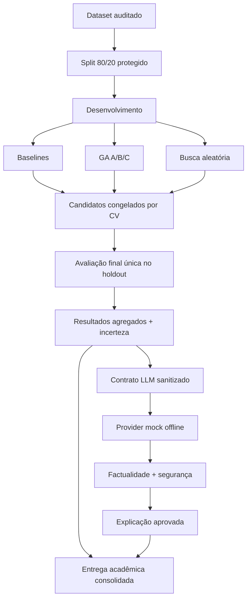

# Tech Challenge — Fase 2 — Algoritmo Genético e LLM

Projeto acadêmico da Pós Tech FIAP que otimiza Regressão Logística, Random Forest e KNN com um algoritmo genético autoral e transforma resultados agregados em explicações controladas por uma camada LLM segura.

O projeto está consolidado para reprodução e demonstração offline. Não oferece diagnóstico, tratamento ou recomendação médica.

## Objetivo e resultado

A seleção ocorreu somente em 455 registros de desenvolvimento, usando cinco dobras estratificadas. Os candidatos foram congelados antes do holdout de 114 registros. O teste final não alterou hiperparâmetros, threshold ou modelo selecionado.

| Família | Recall baseline | Recall GA | FN baseline→GA | Resultado confirmatório |
|---|---:|---:|---:|---|
| Regressão Logística | 0,928571 | 0,976190 | 3→1 | ganho observado |
| Random Forest | 0,904762 | 0,928571 | 4→3 | ganho observado, com AUC menor |
| KNN | 0,904762 | 0,904762 | 4→4 | ganho de CV não confirmado |

Os intervalos permanecem amplos porque o holdout contém apenas 42 casos malignos. Não há evidência suficiente para afirmar superioridade estatística universal ou validade clínica.

## Arquitetura



## Instalação

Requisitos: Python 3.11–3.13 e [uv](https://docs.astral.sh/uv/).

```bash
uv sync
```

O dataset local e as dependências estão identificados por hashes/lock. Segredos não são necessários para a demonstração oficial.

## Reprodução segura da entrega

```bash
uv run pytest
uv run validate-deliverable
uv run run-final-evaluation
uv run run-llm-evaluation
uv run evaluate-llm-output
```

Com os manifestos íntegros e status `completed`:

- `run-final-evaluation` apenas valida e carrega resultados existentes;
- `run-llm-evaluation` reutiliza o provider mock concluído;
- `evaluate-llm-output` recalcula as verificações determinísticas;
- `validate-deliverable` é somente leitura.

Estado validado da entrega: **120 testes aprovados**. Os 14 avisos observados são de depreciação interna de `pyparsing`/Matplotlib e não representam falha funcional ou alteração de resultado.

Não execute os comandos históricos de GA, busca ou baseline durante a demonstração. Eles permanecem no projeto para reprodução metodológica deliberada, não fazem parte do fluxo oficial da Missão 6.

## Estrutura

```text
data/                                dataset auditado
docs/                                relatório, auditorias, métodos e demo
src/tech_challenge_fase2/
  genetic/                            genomas, fitness, operadores e engine
  llm/                                contratos, prompts, providers e checkers
  final_evaluation.py                 avaliação confirmatória protegida
  deliverable.py                      consolidação somente leitura
tests/                                suíte automatizada
artifacts/
  official/                           nove experimentos A/B/C
  selection/                          candidatos congelados
  final_evaluation/                   resultados e incerteza
  llm_evaluation/                     entrada, saída e avaliações LLM
  final_summary/                       tabela e manifesto da entrega
reports/figures/final_presentation/  figuras finais revisadas
```

## Metodologia resumida

O fitness do GA usa:

```text
0,60 × recall maligno médio
+ 0,25 × F1 maligno médio
+ 0,15 × ROC-AUC médio
− 0,10 × desvio-padrão do recall
```

Foram implementados população, torneio, crossover uniforme, mutação tipada, reparação, elitismo, cache, substituição, histórico, checkpoints, estagnação e seeds. Nove experimentos A/B/C realizaram 4.495 avaliações únicas e 22.475 fits em 51,12 minutos. A busca aleatória comparável levou 46,52 minutos.

O modelo para demonstração é a Regressão Logística da busca aleatória, vencedor global congelado antes do holdout. O teste final não reabriu essa decisão.

## Camada LLM segura

A LLM recebe somente resultados agregados. O contrato rejeita registros, features, índices, diagnósticos, previsões e probabilidades individuais. Prompts versionados impõem linguagem científica e disclaimer.

O provider oficial é um mock determinístico offline. A resposta foi aprovada por 139 checks factuais, safety checker e cinco dimensões de avaliação. O provider real é opt-in, não foi chamado na entrega e não é necessário para a demonstração.

## Demonstração

- roteiro de 10–15 minutos: [docs/roteiro_apresentacao.md](docs/roteiro_apresentacao.md);
- guia completo e versão de 5 minutos: [docs/demo_guide.md](docs/demo_guide.md);
- resumo para leitura rápida: [docs/resumo_executivo.md](docs/resumo_executivo.md).

## Segurança metodológica

- split, folds, threshold e seeds congelados;
- seleção por CV antes do holdout;
- avaliação final idempotente;
- ausência de nova otimização ou inferência na consolidação;
- LLM sem dados individuais e sem provider real;
- hashes e manifestos em todas as etapas críticas;
- divergências históricas preservadas.

## Limitações

- 569 registros e uma única fonte;
- apenas 42 malignos no holdout;
- ausência de validação externa, prospectiva e clínica;
- baseline histórico já havia registrado métricas do holdout, embora fora da linhagem de seleção;
- ICs amplos e testes pareados com poucos discordantes;
- uma seed oficial não mede variabilidade completa do GA;
- safety checker determinístico não cobre toda paráfrase;
- provider LLM real não foi avaliado.

## Documentação

- relatório principal: [docs/relatorio_final.md](docs/relatorio_final.md);
- auditoria documental: [docs/auditoria_documental_final.md](docs/auditoria_documental_final.md);
- mapa de evidências: [docs/mapa_evidencias.md](docs/mapa_evidencias.md);
- rastreabilidade: [docs/matriz_rastreabilidade_final.md](docs/matriz_rastreabilidade_final.md);
- algoritmo genético: [docs/algoritmo_genetico.md](docs/algoritmo_genetico.md);
- avaliação final: [docs/avaliacao_final.md](docs/avaliacao_final.md);
- LLM segura: [docs/camada_llm_segura.md](docs/camada_llm_segura.md);
- limitações: [docs/limitacoes_e_validade.md](docs/limitacoes_e_validade.md).

## Disclaimer acadêmico

Este resultado possui finalidade exclusivamente acadêmica e experimental. Os modelos avaliados não foram validados para uso clínico e não devem ser utilizados para diagnóstico, tratamento ou tomada de decisão médica.
