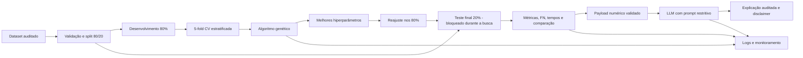

# Decisões técnicas e proposta do algoritmo genético

## Decisões já adotadas

| Decisão | Escolha | Motivo |
|---|---|---|
| Dataset | Mesma cópia da Fase 1, validada por SHA-256 | Comparabilidade e rastreabilidade |
| Classe positiva | Maligno = 1 | Falsos negativos são o risco prioritário |
| Divisão | 80% desenvolvimento / 20% teste, estratificada, seed 42 | Teste final isolado e reproduzível |
| Pré-processamento | `StandardScaler` dentro de pipelines de LR e KNN | Evita vazamento entre treino e avaliação |
| Baselines | LR, Random Forest e KNN com parâmetros da Fase 1 | Comparação direta com a entrega anterior |
| Dependências | `pyproject.toml` + `uv.lock` | Ambiente repetível |
| Evidências | JSON, logs agregados, testes e documentação | Auditoria sem registrar amostras individuais |
| Interface/cloud | Adiadas | O baseline e o método científico vêm primeiro |

## Arquitetura alvo



## Quais modelos otimizar

Decisão aprovada na segunda missão: otimizar os três modelos para cobrir literalmente o plural do enunciado e demonstrar cromossomos distintos. A prioridade de análise será:

1. **Regressão Logística**, por maior recall no baseline e interpretabilidade.
2. **Random Forest**, por representar uma família não linear e permitir explorar um espaço mais rico.
3. **KNN**, como contraste baseado em distância e para mostrar que o mesmo GA aceita outro tipo de cromossomo.

## Representação genética proposta

Os cromossomos serão dicionários tipados, não vetores numéricos opacos. Isso reduz combinações inválidas e deixa a documentação legível.

### Regressão Logística

| Gene | Tipo/domínio | Observação |
|---|---|---|
| `log10_C` | real em [-4, 3] | Decodifica `C = 10^gene` |
| `penalty` | categórico: `l1`, `l2` | Regularização |
| `class_weight` | categórico: `None`, `balanced` | Pode favorecer a classe maligna |

O solver será fixado em `liblinear` para manter compatibilidade com L1 e L2 e evitar indivíduos inválidos. `max_iter=2000` será fixo.

### Random Forest

| Gene | Tipo/domínio |
|---|---|
| `n_estimators` | inteiro [100, 500] |
| `max_depth` | categórico `None` ou inteiro [3, 20] |
| `min_samples_split` | inteiro [2, 20] |
| `min_samples_leaf` | inteiro [1, 10] |
| `max_features` | categórico `sqrt`, `log2`, 0,5, 1,0 |
| `class_weight` | categórico `None`, `balanced`, `balanced_subsample` |

### KNN

| Gene | Tipo/domínio |
|---|---|
| `n_neighbors` | inteiro ímpar [3, 31] |
| `weights` | categórico `uniform`, `distance` |
| `metric` | categórico `minkowski`, `euclidean`, `manhattan` |
| `p` | categórico 1 ou 2 quando `metric=minkowski`; `None` nos demais casos |

**Divergência documentada da proposta preliminar:** `metric` foi incluída para representar explicitamente a escolha de distância e validar sua compatibilidade com `p`. `leaf_size` foi removido porque altera principalmente a eficiência interna, não o comportamento preditivo considerado pelo fitness; seria um gene neutro.

Não será otimizado o limiar de decisão nesta primeira implementação. O limiar 0,5 fica fixo para que a comparação meça hiperparâmetros do modelo. Uma futura calibração de limiar deve ser um experimento separado e também usar somente o conjunto de desenvolvimento.

## Fitness

Cada indivíduo será avaliado nas mesmas cinco dobras de `StratifiedKFold(shuffle=True, random_state=42)` dentro dos 80% de desenvolvimento.

Fórmula implementada:

```text
fitness = 0,60 * média(recall_maligno)
        + 0,25 * média(F1_maligno)
        + 0,15 * média(ROC_AUC)
        - 0,10 * desvio_padrão(recall_maligno)
```

Razões:

- recall recebe o maior peso por causa dos falsos negativos;
- F1 limita soluções que aumentam recall classificando quase tudo como maligno;
- ROC-AUC mede separação sem depender apenas do limiar;
- a penalidade de instabilidade prefere soluções consistentes entre dobras;
- accuracy será registrada, mas não guiará a busca isoladamente.

O coeficiente de instabilidade é 0,10. Como o desvio-padrão do recall limitado a [0, 1] não ultrapassa 0,5, a penalidade máxima possível é 0,05. Testes sintéticos confirmam o cálculo e que maior instabilidade reduz o fitness quando as médias são iguais.

## Operadores

| Operador | Escolha | Detalhe |
|---|---|---|
| Inicialização | Amostragem uniforme por domínio | Duplicatas removidas por hash do cromossomo |
| Seleção | Torneio | Simples, reproduzível e não exige fitness positivo |
| Cruzamento | Uniforme por gene | Funciona com genes mistos e cromossomos em dicionário |
| Mutação | Específica por tipo | Real recebe perturbação; inteiro muda dentro dos limites; categórico troca de categoria |
| Elitismo | Melhores indivíduos copiados | Evita perder a melhor solução encontrada |
| Reparação | Validador pós-operação | Garante inteiros, ímpares, faixas e categorias válidas |
| Cache | Chave por modelo+cromossomo+folds | Evita refazer avaliações idênticas |

Todos esses operadores foram implementados diretamente no projeto, sem DEAP, pygad ou outra biblioteca de evolução. O engine também implementa substituição geracional, histórico, melhor global, parada por máximo de gerações e parada opcional por estagnação.

## Três configurações experimentais

As três configurações usarão os mesmos folds e seed-base para isolar o efeito dos parâmetros do GA.

| Experimento | População | Gerações | Crossover | Mutação por gene | Torneio | Elites | Intenção |
|---|---:|---:|---:|---:|---:|---:|---|
| A - pequena | 20 | 10 | 0,70 | 0,10 | 3 | 2 | Baixo custo e validação da busca |
| B - equilibrada | 40 | 20 | 0,80 | 0,20 | 3 | 2 | Referência principal |
| C - exploratória | 60 | 30 | 0,75 | 0,30 | 4 | 4 | Maior diversidade e orçamento |

**Divergência documentada da proposta preliminar:** as configurações foram substituídas pelos valores aprovados na segunda missão. O teto passou a 43.800 fits nos três modelos. A extrapolação dos smoke tests indica aproximadamente 81,5 minutos em série, com a Random Forest dominando o custo. O número real tende a ser menor quando o cache elimina duplicatas.

## Como evitar overfitting

- teste final inacessível ao fitness e aos gráficos de seleção;
- folds estratificados fixos e iguais para todos os métodos;
- penalidade para variância de recall entre folds;
- espaço de busca definido antes da execução;
- orçamento finito e registrado;
- cache sem alterar o resultado;
- seleção do vencedor somente por métricas de CV;
- reajuste único nos 80% e avaliação final única;
- resultado desfavorável será relatado, não descartado.

## Critério da melhor solução

1. maior fitness médio de CV;
2. em empate numérico, maior recall maligno médio;
3. depois, menor desvio do recall;
4. depois, maior F1 e ROC-AUC;
5. por fim, chave canônica do genoma para desempate determinístico.

**Divergência documentada da proposta preliminar:** tempo e complexidade continuam registrados, mas não desempatarão automaticamente indivíduos. Tempo de parede é ruidoso e poderia quebrar a reprodutibilidade entre execuções idênticas. Uma preferência por simplicidade poderá ser aplicada na análise humana após a busca, sem alterar silenciosamente o fitness.

O modelo otimizado só será chamado de melhoria se superar o respectivo baseline no objetivo clínico sem deterioração desproporcional de precisão/F1 e com incerteza explicitada. O ranking de CV e a avaliação de teste serão mostrados separadamente.

## Comparação com RandomizedSearchCV

É recomendada como benchmark adicional, não como requisito oficial. A comparação justa usará:

- o mesmo espaço de busca;
- as mesmas dobras;
- a mesma função de scoring;
- o mesmo número máximo de candidatos únicos avaliados;
- a mesma regra de reajuste e o mesmo teste final;
- tempo de parede e número de fits registrados.

Isso permite concluir se o GA encontrou solução melhor ou apenas consumiu mais busca. A comparação não deve ser usada para esconder um resultado negativo do algoritmo genético.

## Estado validado da terceira missão

- genomas tipados e espaços válidos para os três modelos;
- fitness isolado com cinco dobras estratificadas apenas no desenvolvimento;
- população, torneio, crossover, mutação, reparação, elitismo e substituição;
- cache, histórico, parada e melhor indivíduo;
- JSON com schema validado e logging por geração;
- 58 testes automatizados aprovados na validação final;
- smoke tests dos três modelos sem falhas;
- assinatura idêntica em duas execuções com seed 42 e diferente com seed 43;
- nove execuções oficiais A/B/C concluídas e validadas;
- baseline comparável recalculado nos mesmos folds;
- `RandomizedSearchCV` executado sem `refit`, com orçamento equivalente ao melhor GA;
- candidatos provisórios congelados sem ajuste final;
- sete figuras produzidas somente com dados de CV;
- nenhuma avaliação de candidatos no teste final.

## Decisões da execução oficial

- A ordem foi A, B e C; dentro de cada configuração, LR, Random Forest e KNN.
- A seed oficial comum foi 42 para split, folds, GA e estimadores compatíveis.
- `n_jobs=1` foi preservado em toda a bateria e na busca aleatória.
- Checkpoints completos são gravados a cada geração com estado do RNG, população, cache, histórico e contadores.
- Um experimento só é reutilizado quando artefato e status estão `completed` e a identidade assinada coincide com configuração, dataset, índices de desenvolvimento, versão e código relevante.
- A busca aleatória usa múltiplos scorers e `refit=False`. O fitness composto é calculado de forma auditável sobre `cv_results_`, evitando treinar um modelo final nesta missão.
- O KNN possui somente 120 combinações únicas no espaço aprovado; o teto foi registrado explicitamente.

Após os resultados, foi corrigida apenas a normalização da chave canônica entre métodos. O GA serializava `log10_c` e a busca aleatória serializava `C`, embora ambos representassem o mesmo gene. A correção não alterou fitness, espaços, operadores, folds ou resultados; invalidou e regenerou somente os artefatos derivados de seleção, congelamento e figuras.

## Seleção congelada por CV

| Modelo | Melhor GA | Vencedor provisório entre métodos |
|---|---|---|
| Regressão Logística | C, fitness 0,973166 | RandomizedSearchCV, fitness 0,973166 |
| Random Forest | C, fitness 0,961648 | GA C |
| KNN | A/B/C empatados, fitness 0,953990 | GA A, solução idêntica à busca aleatória |

O vencedor global provisório é a Regressão Logística da busca aleatória. Tempo não participou do desempate. Resultados de teste final já existentes no baseline histórico não foram lidos pela seleção.

## Decisões implementadas para a LLM

- entrada somente por payload estruturado de métricas e explicações calculadas pelo código;
- nenhum dado pessoal ou clínico real enviado a provedor;
- nenhuma inferência ou diagnóstico criado pela LLM;
- números citados devem existir no payload;
- linguagem de apoio e revisão humana obrigatória;
- prompts versionados;
- temperatura baixa e modelo/provedor registrados;
- avaliação por correção factual, completude, clareza, segurança e alucinação;
- testes offline com mocks, além de amostras reais apenas quando autorizado.

A quinta missão concretizou essas diretrizes com contratos fechados e JSON Schema, prompts `system_v1`/`explanation_v1`, `FakeLLMProvider` e `OpenAIResponsesProvider`. A chamada real é opt-in, usa `store=false` e exige chave/modelo preenchidos manualmente no `.env`; a execução oficial permaneceu offline.

Factualidade e segurança são independentes do provider. O primeiro checker compara modelo, método, métricas, FN, intervalos, deltas e conclusões diretamente com a entrada agregada. O segundo aplica regras determinísticas contra diagnóstico, tratamento, recomendação, uso clínico, certeza indevida e disclaimer ausente. A aprovação exige também completude, clareza e calibração científica.

Pydantic não foi acrescentado porque não integrava o ambiente congelado e os contratos são pequenos. Foram usados validadores recursivos fechados, dataclasses para request/response e JSON Schema com `additionalProperties=false`, evitando uma dependência nova sem reduzir a rigidez.

Os quatro artefatos estruturados prioritários da Missão 4 não expõem um campo de vencedor global. Essa lacuna não foi corrigida silenciosamente: a camada usa como fonte auxiliar a decisão congelada documentada, confirma que `logistic_regression__random_search` existe e empata no maior fitness de CV, inclui o hash documental e registra a limitação no payload.

## Decisões da avaliação final

- O preflight e a execução foram separados em comandos distintos.
- O plano final foi assinado antes de qualquer ajuste/predição confirmatória.
- O manifesto vigente identificou GA B como candidato logístico; essa autoridade prevaleceu sobre textos anteriores que ainda citavam C no empate.
- Nove origens foram relatadas, mas KNN GA/aleatória compartilharam o mesmo treino por serem canonicamente idênticos.
- Cada probabilidade foi convertida em classe pelo limiar fixo 0,5.
- Intervalos de Wilson foram usados para proporções; deltas baseline/GA receberam bootstrap pareado de 5.000 réplicas, seed 42; McNemar foi exato.
- O teste não mudou vencedor, hiperparâmetros, preprocessing, espaço, fitness ou narrativa de seleção.
- O modelo previsto para demonstração continua sendo a Regressão Logística da busca aleatória, vencedor global congelado antes do holdout.
- As figuras 1 e 2 receberam correção de layout após inspeção visual. O `figure_qa_report.json` prova que não houve recálculo de métricas, ajuste ou predição.

Resultado confirmatório: LR e RF GA reduziram falsos negativos; KNN GA manteve recall/FN, melhorou F1/especificidade e reduziu ROC-AUC. As diferenças são descritivas e não demonstram superioridade clínica.
