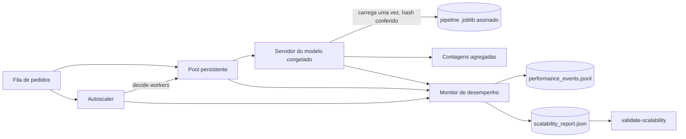
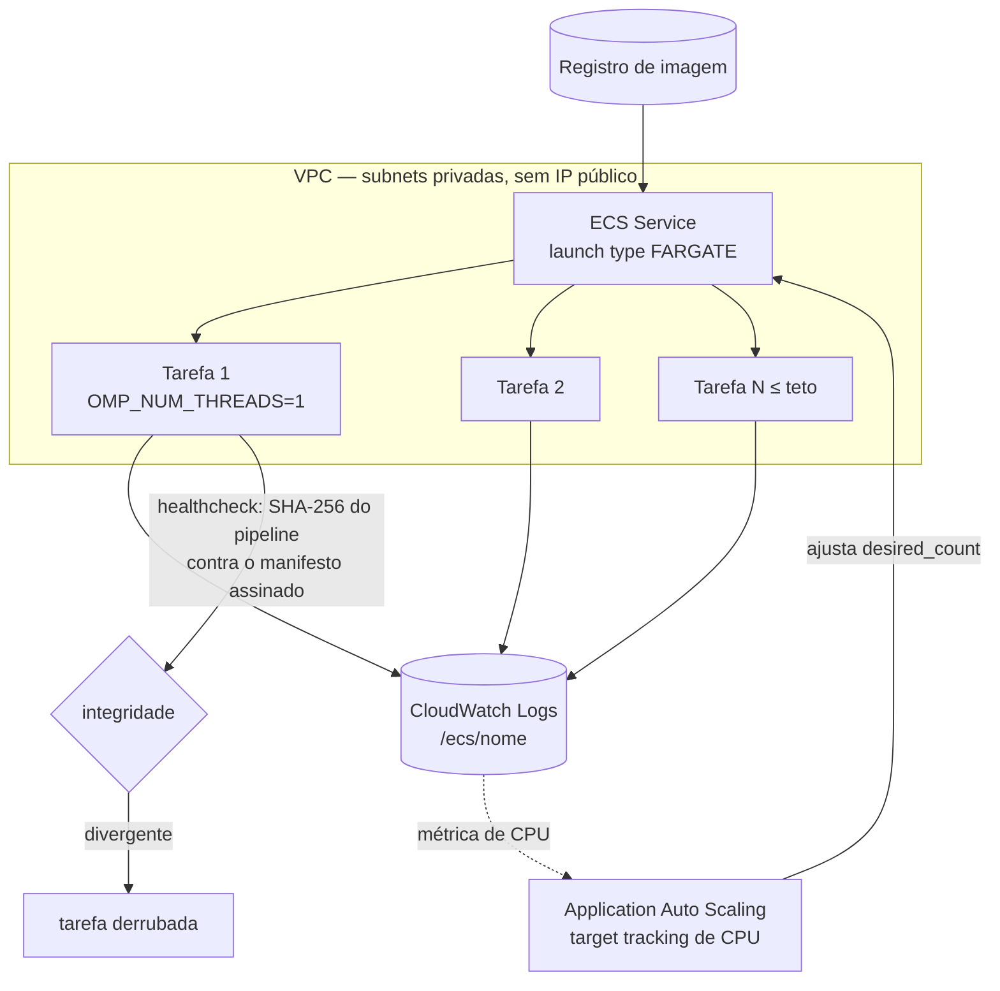

# Escalabilidade automática e monitoramento de desempenho

Documento do requisito 2 do enunciado: configurar recursos de escalabilidade automática para lidar com variações de demanda, com monitoramento e logging adequados para tracking de desempenho, e documentar arquitetura e decisões.

O escopo é a **execução** do modelo já congelado. Nada aqui treina, reabre seleção, altera o limiar ou consulta o holdout. A camada existe para responder a picos de demanda sobre uma decisão que já estava tomada.

## 1. Arquitetura



Quatro componentes, cada um com uma responsabilidade única:

| Componente | Arquivo | Responsabilidade |
|---|---|---|
| Política de dimensionamento | `serving/autoscaling.py` | Decide o número de workers a partir do backlog. Função pura, sem relógio nem threads. |
| Servidor do modelo | `serving/model_server.py` | Carrega o pipeline congelado uma vez, confere o hash e responde a lotes. |
| Monitoramento | `serving/monitoring.py` | Eventos estruturados de desempenho, com barreira contra dado individual. |
| Benchmark de carga | `serving/load_benchmark.py` | Submete demanda variável e produz evidência comparável. |

## 2. Decisões de implementação

**A política é uma função pura.** `AutoscalingPolicy.decide` recebe backlog, workers atuais e tempo desde a última mudança, e devolve uma decisão. Separar decisão de execução permite testá-la de forma determinística — sem relógio, threads ou modelo carregado — e permite auditar por que cada troca de tamanho ocorreu. O histórico fica em `AutoscalerState.history`.

**Há histerese, não um alvo único.** A política persegue `target_backlog_per_worker = 4`, mas só age fora da faixa entre `scale_down_backlog_per_worker = 2` e `scale_up_backlog_per_worker = 6`. Sem essa faixa morta, um backlog oscilando ao redor do alvo trocaria o tamanho do pool a cada ciclo. O cooldown opcional adia uma mudança sem perder a intenção: a decisão é registrada como `cooldown_block` com o `desired_workers` que teria sido aplicado.

**O modelo é carregado uma vez.** É isso que torna o serviço escalável: o custo por pedido passa a ser apenas a predição, não a desserialização. A carga é preguiçosa e protegida por lock, para que várias réplicas não desserializem o mesmo arquivo em paralelo.

**O hash é conferido antes de servir.** `resolve_frozen_model` lê o plano e o manifesto assinados da avaliação final, localiza o pipeline do candidato congelado e compara o SHA-256 do arquivo com o registrado. Divergência interrompe o arranque em vez de servir um modelo desconhecido — no container isso vira o `HEALTHCHECK`.

**Uma thread de BLAS por worker.** Esta foi a decisão menos óbvia e a que mais afetou o resultado, descrita na seção 4.

**O pool é persistente e a concorrência é um semáforo.** Criar um `ThreadPoolExecutor` por ciclo pagaria criação de threads a cada rajada e mediria o custo do agendador em vez do serviço. O pool é criado uma vez com o teto da política, e a decisão do autoscaler ajusta um semáforo que limita quantos pedidos ocupam o modelo simultaneamente.

## 3. Monitoramento sem dado de paciente

A camada LLM do projeto já recusa registros individuais. A observabilidade repete a barreira: um evento de desempenho guarda contagens, tempos e tamanhos, nunca features, probabilidades por registro ou identificadores.

A validação é aplicada **na escrita**, não em revisão posterior — log emitido não pode ser retirado de onde já foi coletado. `assert_event_is_aggregate` recusa:

- chaves de identificação (`id`, `patient_id`, `record_id`, `index`);
- alvo e rótulo (`diagnosis`, `target`, `label`, `y_true`, `y_pred`);
- saída por registro (`probability`, `predictions`, `features`);
- as mesmas chaves em qualquer nível aninhado;
- séries com mais de 64 itens, que poderiam reconstruir saídas por registro.

A barreira já reprovou código deste próprio projeto: o benchmark usava `label` para nomear o cenário, colidindo com o termo de rótulo de classe. O campo foi renomeado para `scenario`; a lista de proibições não foi afrouxada.

O serviço também não devolve probabilidade por registro. `BatchOutcome` carrega apenas `batch_size`, `positive_count` e `latency_ms`.

Os eventos são gravados em JSON Lines em `artifacts/scalability/performance_events.jsonl`, e `validate-scalability` reprocessa cada linha pela mesma barreira.

## 4. O achado que mudou o desenho

A primeira medição mostrou o pool autoescalável **mais lento** que o pool fixo mínimo. A causa não era a política, e sim a configuração numérica: o BLAS paraleliza cada `predict_proba` internamente, de modo que um único worker já saturava as 4 CPUs disponíveis. Adicionar workers apenas somava contenção.

Fixar uma thread de BLAS por worker inverte a relação: o paralelismo passa a vir das réplicas, que são exatamente o recurso que o autoscaling controla. É a configuração usual de serviços de inferência, e está aplicada no `Dockerfile`, no `docker-compose.yml`, na task definition do Terraform e no CLI, sempre antes de qualquer import que carregue NumPy.

Um segundo efeito apareceu em seguida: mesmo com o BLAS fixado, lotes pequenos não ganhavam nada. Em vez de escolher um tamanho de lote favorável, a varredura foi incorporada à evidência.

## 5. Resultados

Ambiente da medição: 4 CPUs, uma thread de BLAS por worker, política de 1 a 4 workers, lotes de 40.000 registros, 146 pedidos ao longo de um perfil de vale, rajada e drenagem.

| Cenário | p95 | p99 | Vazão | Tempo total | Trocas de tamanho |
|---|---:|---:|---:|---:|---:|
| Pool fixo mínimo | 131,6 ms | 149,8 ms | 177,7 req/s | 0,82 s | 0 |
| Pool autoescalável | 74,6 ms | 78,5 ms | 301,9 req/s | 0,48 s | 3 |

O autoscaling reduziu a latência p95 em **1,76x** e elevou a vazão em **1,70x** sobre exatamente a mesma sequência de chegadas. A linha de workers acompanha o perfil: ocioso em 1, sobe para 4 durante a rajada, drena de volta a 1.

### Escalar réplicas tem um limiar

| Registros por pedido | Custo serial por pedido | Aceleração com 4 workers |
|---:|---:|---:|
| 2.000 | 1,6 ms | 0,82x |
| 8.000 | 1,9 ms | 0,94x |
| 20.000 | 3,9 ms | 1,81x |
| 40.000 | 6,8 ms | 2,22x |

Abaixo de aproximadamente 2 ms por pedido, o despacho custa mais que o trabalho e adicionar réplicas **piora** o desempenho. O ganho só aparece acima desse limiar. Escalabilidade automática não é benéfica em qualquer regime, e a política precisa de um piso de custo por pedido para ser útil.


## 6. Reprodução

```bash
uv run run-load-benchmark
uv run validate-scalability
```

O primeiro comando mede e escreve `artifacts/scalability/`. O segundo é somente leitura: confere assinatura, coerência entre cenários, teto respeitado, confirmações de escopo e ausência de dado individual no log.

## 7. Arquitetura da solução em nuvem



| Recurso | Papel |
|---|---|
| `aws_ecs_cluster` | Cluster Fargate, com Container Insights habilitado |
| `aws_ecs_task_definition` | Tarefa com BLAS fixado em uma thread e healthcheck de integridade do modelo |
| `aws_ecs_service` | Serviço em subnets privadas, sem IP público e sem balanceador |
| `aws_appautoscaling_target` | Piso e teto de tarefas, espelhando `min_workers` e `max_workers` |
| `aws_appautoscaling_policy` | Target tracking de CPU, com cooldowns assimétricos |
| `aws_cloudwatch_log_group` | Recebe os eventos de desempenho |

Três decisões merecem nota.

**O recurso escalado é o mesmo nos dois planos.** Na nuvem é `desired_count` de tarefas; localmente é o número de workers. Manter o piso e o teto alinhados faz o benchmark local medir o comportamento que o IaC provisiona, em vez de duas coisas diferentes com o mesmo nome.

**Os cooldowns são assimétricos:** 60 s para subir, 300 s para descer. É o equivalente na nuvem da histerese da política local — descer depressa demais devolve a fila ao gargalo que acabou de ser aliviado.

**O autoscaling passa a ser dono de `desired_count`.** O serviço declara `ignore_changes = [desired_count]`; sem isso, cada `apply` devolveria o serviço ao piso, desfazendo a decisão do autoscaling.

O `Dockerfile` fixa uma thread de BLAS por réplica e confere o SHA-256 do pipeline congelado no `HEALTHCHECK`: hash divergente derruba a tarefa em vez de servir um modelo desconhecido. O `docker-compose.yml` reproduz localmente o mesmo recurso, via `deploy.replicas`.

A imagem é construída e o módulo Terraform é formatado e validado no CI a cada push, então a configuração é verificada mesmo sem ser aplicada.

A infraestrutura é acadêmica e **não foi provisionada**: nenhum recurso pago foi criado e nenhum endpoint público existe. Instruções em [`../deploy/README.md`](../deploy/README.md).

## 8. Limitações

- A medição depende do hardware. O relatório registra `measurement_is_environment_dependent: true` e as CPUs observadas; os números não devem ser citados como característica do modelo.
- Os lotes do gerador de carga replicam o conjunto de desenvolvimento para atingir volume realista. Isso é geração de carga, não dado novo: nenhuma métrica de modelo, seleção ou conclusão do estudo deriva desse frame.
- O escalonamento medido é por threads em um processo. Réplicas de processo ou container, que é o que a nuvem escala, não foram medidas neste ambiente.
- A política reage ao backlog observado; não antecipa demanda nem usa previsão de série temporal.
- O Terraform não foi aplicado e portanto não há evidência de comportamento em nuvem real.
