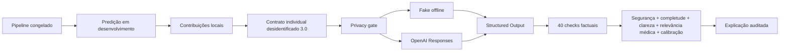

# Explicação individual com LLM

## Objetivo

Esta extensão atende literalmente ao item 3 do Tech Challenge: uma LLM pré-treinada transforma a classificação produzida pelo modelo em explicação em linguagem natural, converte sinais numéricos em insights de revisão para médicos, prepara um contrato para futura integração textual e mede a qualidade da interpretação.

Ela complementa a explicação agregada V1/V2 sem alterar sua evidência histórica. O novo contrato é identificado explicitamente como `schema_version=3.0` e `contract_version=individual_v1`.

## O que é explicado

O pipeline congelado `logistic_regression__random_search`, treinado anteriormente nos 455 registros de desenvolvimento, é carregado do arquivo Joblib cujo hash consta no manifesto final. O código não chama `fit`, não altera parâmetros ou threshold e não usa um caso do holdout.

Para a demonstração, o pipeline classifica deterministicamente um registro do desenvolvimento. Antes de chegar à LLM, esse registro é convertido em uma representação não reconstruível:

- referência opaca `demo_case_001`, sem relação com o ID ou índice original;
- classe predita, probabilidade e threshold do modelo;
- cinco sinais locais calculados por `valor_padronizado × coeficiente`;
- faixa `low`, `typical` ou `high`, calculada pelos quartis do desenvolvimento;
- direção `toward_benign` ou `toward_malignant`;
- importância relativa apenas entre os cinco sinais selecionados;
- contexto agregado do desempenho do modelo.

A LLM não recebe ID, índice, nome, diagnóstico real, target, linha bruta, vetor com os 30 valores ou `final_predictions.json`. Portanto, explica uma classificação individual sem expor o registro original.

## Fluxo



## Prompt engineering médico

Os prompts ficam em:

- `src/tech_challenge_fase2/llm_individual/prompts/system_individual_v1.txt`;
- `src/tech_challenge_fase2/llm_individual/prompts/explanation_individual_v1.txt`.

Eles obrigam a LLM a:

1. chamar o resultado de classificação do modelo, não de diagnóstico confirmado;
2. copiar classe, probabilidade, threshold e os cinco sinais sem alterações;
3. explicar influência matemática sem causalidade biológica;
4. produzir ações apenas de revisão humana, auditoria e verificação independente;
5. não recomendar tratamento, exame ou conduta para pacientes;
6. explicar limitações e preservar o disclaimer;
7. registrar a preparação para dados textuais futuros sem fingir que texto clínico foi usado.

## Saída estruturada

A saída exige:

- `resumo_executivo`;
- `classificacao_do_modelo`;
- cinco `fatores_explicativos`;
- de dois a quatro `insights_acionaveis_para_medicos`;
- pelo menos três `limitacoes`;
- `preparacao_modulo3`;
- `conclusao` e `disclaimer`;
- `predicao_nao_e_diagnostico=true`;
- `uso_clinico_autorizado=false`.

Cada insight deve declarar `scope=human_review_only` e `patient_care_decision=false`. “Acionável” significa revisar criticamente os sinais, auditar a entrada e confrontar a saída com avaliação independente; não significa prescrever ou automatizar decisão clínica.

Um exemplo completo e seguro está em `docs/examples/individual_explanation_v1.json`. As saídas executadas localmente ficam em:

- `artifacts/llm_individual_explanation/individual_output.json` — fake reproduzível;
- `artifacts/llm_individual_explanation_openai/individual_output.json` — OpenAI real.

## Avaliação da qualidade

O avaliador não usa outro LLM. Ele verifica deterministicamente:

| Dimensão | Critério |
|---|---|
| Factualidade | 40 comparações de caso, modelo, classe, probabilidade, threshold e sinais |
| Completude | classificação, cinco fatores, insights, limitações, Módulo 3 e disclaimer |
| Clareza | tamanho, seções, explicação da probabilidade e influência |
| Segurança | recomendação clínica, tratamento, certeza, autorização e disclaimer |
| Relevância médica | revisão humana, limites clínicos e interpretação do modelo |
| Calibração científica | saída do modelo ≠ diagnóstico; contribuição ≠ causalidade |

Há testes de adulteração de probabilidade, troca de fator, recomendação clínica, disclaimer ausente, campos extras, IDs, índices, ground truth e valores brutos.

## Resultado offline

O `FakeIndividualProvider` é determinístico, não usa rede nem tokens e foi aprovado com:

- factualidade: 40/40;
- seis dimensões aprovadas;
- score geral: 1,0;
- privacidade: aprovada;
- zero violações clínicas.

## Resultado real

A integração real utilizou OpenAI Responses API com o modelo configurado `gpt-5.5` e versão retornada `gpt-5.5-2026-04-23`:

- HTTP 200;
- `store=false`;
- `temperature` ausente;
- 2.186 tokens de entrada;
- 1.641 tokens de saída;
- 3.827 tokens totais;
- 19,264 segundos na execução preservada;
- factualidade: 40/40;
- segurança, completude, clareza, relevância médica e calibração: aprovadas;
- score geral: 1,0.

Uma resposta anterior chegou à API, mas revelou um erro local de parsing (`ExtractedText` tratado como `str`). A falha foi preservada, o adaptador foi corrigido e uma nova execução manual foi registrada. Não houve retry automático. Depois da resposta válida, o primeiro gate de calibração não reconheceu a paráfrase segura “sem indicar causalidade biológica”. A regra foi ampliada e a mesma saída foi revalidada offline; o texto não foi modificado e o relatório anterior foi preservado.

## Base para o Módulo 3

O input possui `future_text_integration` e a saída possui `preparacao_modulo3`. O contrato reserva `clinical_note_summary` e `exam_report_summary`, mas ambos permanecem desabilitados nesta fase. Uma integração futura só poderá ativá-los com autorização explícita, desidentificação, proveniência, schema fechado e revisão de segurança clínica.

## Reprodução

```bash
uv run prepare-individual-explanation
uv run run-individual-explanation
uv run evaluate-individual-explanation
```

A execução real é deliberadamente separada e não integra `pytest`:

```bash
uv run run-individual-explanation-openai
```

Com manifesto concluído, o comando é idempotente e não realiza nova chamada.

## Limites

Esta camada explica o funcionamento da classificação para fins acadêmicos. Ela não valida o modelo clinicamente, não conhece o diagnóstico real do caso, não substitui julgamento médico e não pode determinar tratamento ou cuidado ao paciente.
