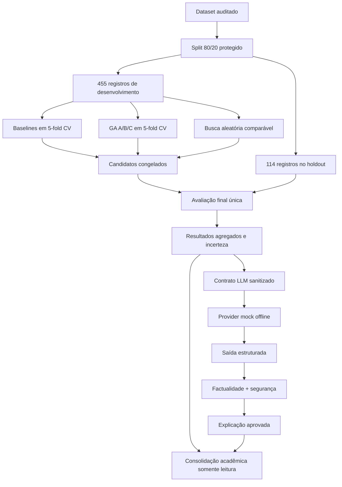

# Matriz de rastreabilidade final

| Requisito | Missão | Implementação | Teste/validação | Evidência | Status |
|---|---:|---|---|---|---|
| Dataset e split protegidos | 1/4 | `data.py`, plano final | testes de dados e preflight | `final_evaluation_plan.json` | Concluído |
| Scaler sem vazamento | 1/2 | Pipelines LR/KNN | testes de modelos e pipeline | código + plano | Concluído |
| GA reproduzível | 2/3 | `genetic/engine.py` e seeds | reprodutibilidade seed 42/43 | artefatos smoke/oficiais | Concluído |
| Genomas tipados e válidos | 2 | `genomes.py`, `search_spaces.py` | testes de genomas | `algoritmo_genetico.md` | Concluído |
| Fitness em 5-fold CV | 2 | `genetic/fitness.py` | testes de fitness | artefatos por dobra | Concluído |
| Torneio, crossover, mutação, reparo, elitismo | 2 | `operators.py`, engine | testes unitários | código + históricos | Concluído |
| Cache, checkpoint e serialização | 2/3 | engine oficial | testes de retomada/JSON | `official/` | Concluído |
| Três configurações A/B/C | 3 | `config.py` | nove status completed | `execution_manifest.json` | Concluído |
| Busca aleatória comparável | 3 | `comparison.py`, `refit=False` | testes de comparação | `randomized_search_cv.json` | Concluído |
| Ausência de tuning no holdout | 3/4 | separação seleção/avaliação | preflight e lineage | `preflight_report.json` | Concluído |
| Candidatos congelados | 3 | seleção determinística | assinaturas | `frozen_candidates.json` | Concluído |
| Avaliação final única | 4 | engine idempotente | testes de status/manifesto | `final_manifest.json` | Concluído |
| Threshold fixo | 1–4 | constante 0,5 | plano e resultados | `classification_threshold` | Concluído |
| IC95% de Wilson | 4 | função de intervalo | teste estatístico | `uncertainty_results.json` | Concluído |
| Bootstrap pareado | 4 | 5.000 réplicas, seed 42 | teste determinístico | `uncertainty_results.json` | Concluído |
| McNemar exato | 4 | comparação pareada | teste sintético | `uncertainty_results.json` | Concluído |
| Modelos serializados e assinados | 4 | joblib local | round trip + hashes | `final_manifest.json` | Concluído |
| LLM sem dados individuais | 5 | contrato + privacy gate | injeções proibidas | `llm_input_snapshot.json` | Concluído |
| Prompts versionados | 5 | `system_v1`, `explanation_v1` | hashes/cabeçalhos | manifesto LLM | Concluído |
| Provider fake offline | 5 | `FakeLLMProvider` | rede bloqueada nos testes | manifesto LLM | Concluído |
| Provider real opt-in | 5 | Responses configurável | requisição simulada | código; não chamado | Concluído sem execução real |
| Factualidade automática | 5 | checker independente | número/modelo/IC incorretos | `factuality_report.json` | Concluído |
| Safety checker | 5 | regras determinísticas | diagnóstico, certeza, disclaimer | `safety_report.json` | Concluído |
| Avaliação em 5 dimensões | 5 | `evaluation.py` | casos A–I | `evaluation_report.json` | Concluído |
| Idempotência LLM | 5 | identidade e hashes | provider não chamado duas vezes | manifesto LLM | Concluído |
| Relatório e resumo acadêmicos | 6 | documentos finais | validador de links/números | `relatorio_final.md` | Concluído |
| Tabela mestre derivada | 6 | `deliverable.py` | comparação com JSON fonte | `model_results.*` | Concluído |
| Figuras agregadas com QA | 6 | seis gráficos estáticos | hashes + inspeção visual | `figure_qa_report.json` | Concluído |
| Manifesto final | 6 | hashes e confirmações | `validate-deliverable` | `final_delivery_manifest.json` | Concluído |
| Demonstração offline | 6 | fluxo idempotente | guia de 5/15 minutos | `demo_guide.md` | Concluído |
| API/frontend/cloud/deploy | — | fora do escopo aprovado | confirmação de ausência | manifesto final | Não implementado por decisão |

## Arquitetura consolidada

