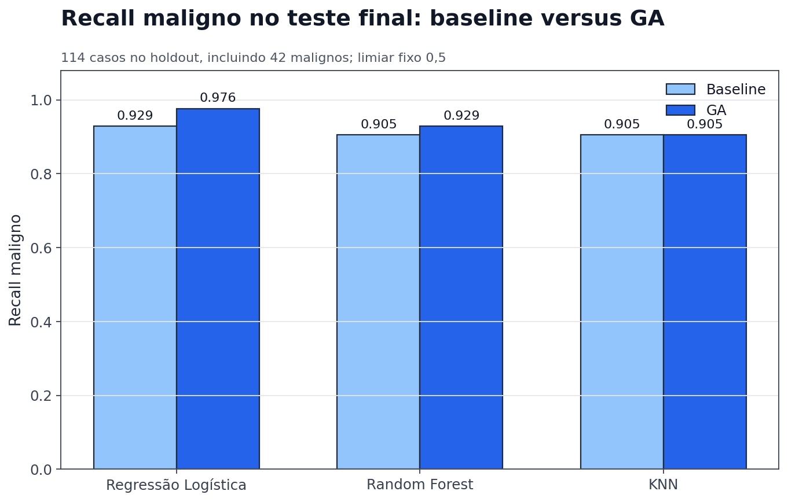
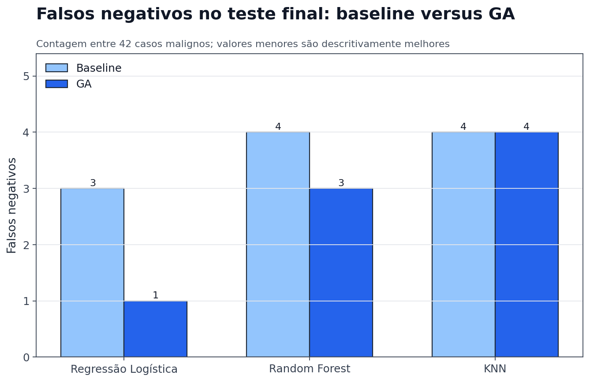
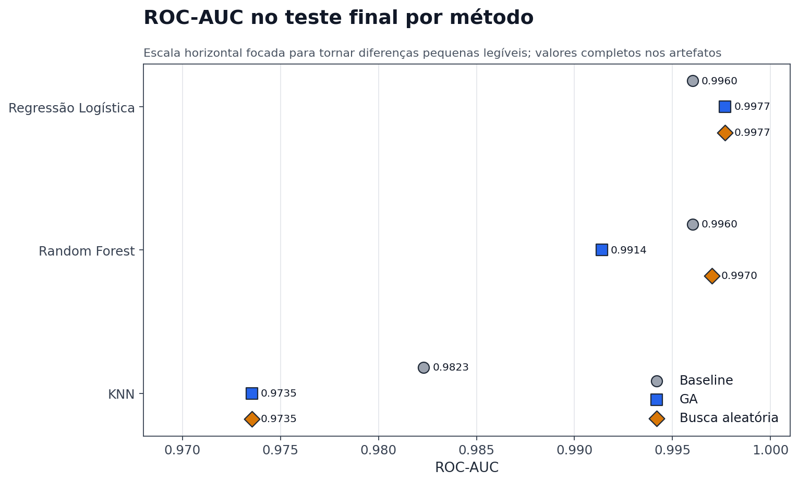
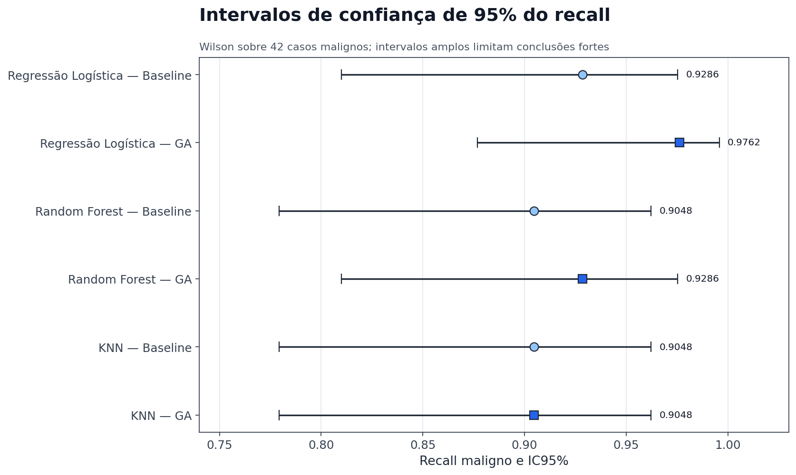
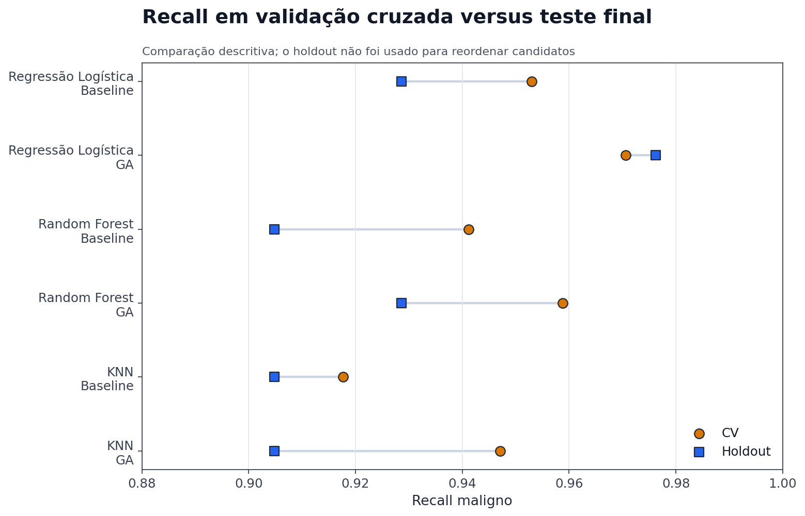
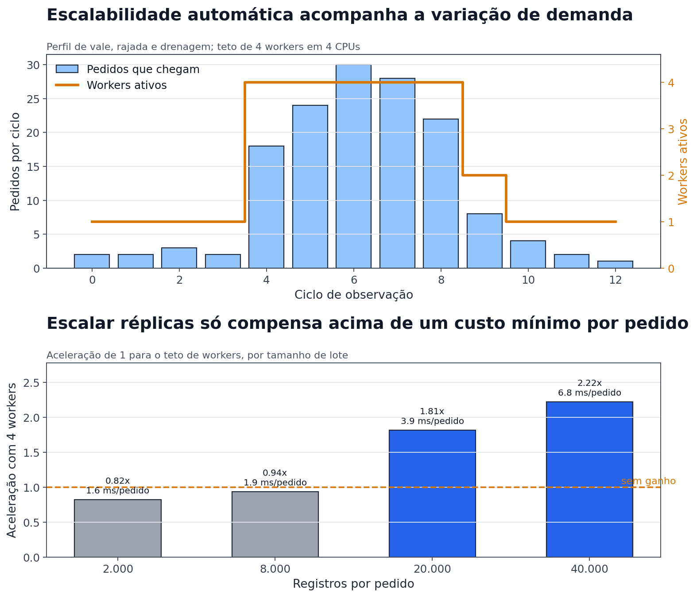
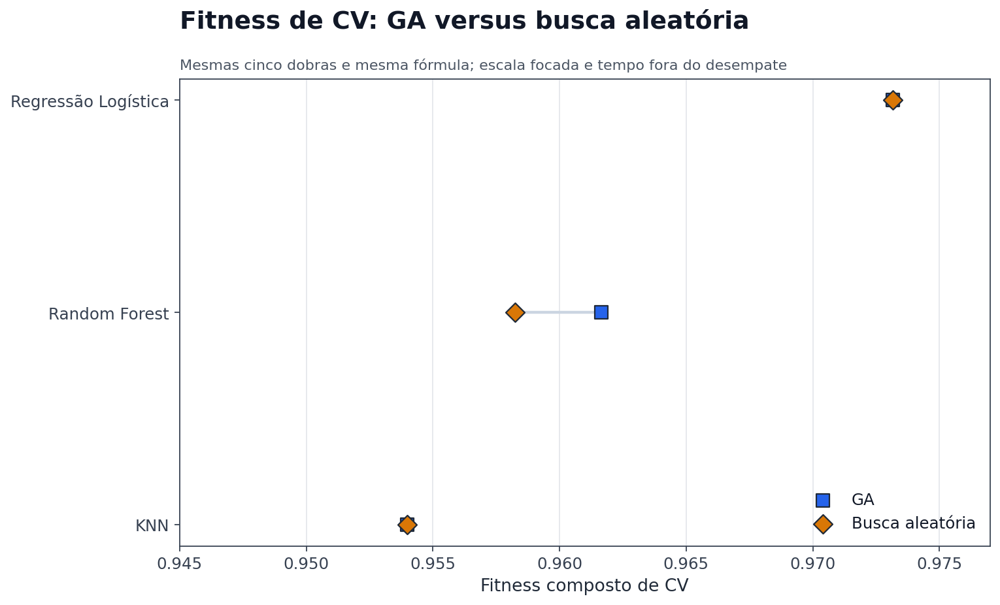

# Relatório final — otimização genética e explicação segura de resultados

## Resumo técnico

O projeto está consolidado para entrega acadêmica e demonstração offline: a seleção ocorreu somente nas 455 linhas de desenvolvimento, os candidatos foram congelados antes do holdout (teste final), a avaliação confirmatória não reabriu decisões e a camada LLM explica resultados agregados e uma classificação individual desidentificada sob validação factual e de segurança. O GA foi útil no objetivo prioritário de recall para Regressão Logística e Random Forest no holdout, reduzindo falsos negativos de 3 para 1 e de 4 para 3. No KNN, o ganho observado em validação cruzada não se confirmou: recall e falsos negativos permaneceram em `0,904762` e 4.

Esses resultados são descritivos e experimentais. Os intervalos são amplos, os deltas de recall incluem zero no limite ou interior dos intervalos bootstrap e McNemar tem somente 1–3 pares discordantes. Portanto, não há evidência suficiente para afirmar superioridade estatística universal, superioridade clínica ou aptidão para diagnóstico.

## 1. Introdução

O trabalho parte de um classificador de tumores da Fase 1 e responde a duas questões acadêmicas: se um algoritmo genético (GA) autoral consegue buscar hiperparâmetros de três famílias com controle metodológico e se uma LLM consegue explicar resultados agregados sem inventar fatos ou transformar evidência experimental em recomendação médica.

O escopo cobre auditoria, baseline, GA, experimentos A/B/C, benchmark com busca aleatória (`RandomizedSearchCV`), seleção por validação cruzada, avaliação final protegida e LLM segura. API, frontend, cloud e deploy não fazem parte da solução. A contribuição principal não é apenas obter métricas: é tornar a cadeia inteira rastreável, reproduzível e defensável.

## 2. Dataset e problema de classificação

Foi preservada a cópia local do Breast Cancer Wisconsin (Diagnostic) declarada pela Fase 1, com SHA-256 `1425d9affa78ba8e53afc81d0ef8a19069ee10c4b21fe89b3cf514071b12ee33`. O conjunto possui 569 registros, 30 preditores numéricos, 357 casos benignos e 212 malignos. O alvo `diagnosis` foi mapeado para benigno `0` e maligno `1`; `id` e a coluna vazia foram removidos.

O split estratificado com seed 42 produziu 455 registros de desenvolvimento — 285 benignos e 170 malignos — e 114 no holdout — 72 benignos e 42 malignos. O limiar de classificação permaneceu `0,5`. Como somente 42 casos positivos sustentam o recall final, uma observação altera essa métrica em cerca de 2,38 pontos percentuais.

O dataset é pequeno, vem de uma única fonte e não representa validação clínica, externa ou prospectiva. O projeto avalia engenharia de machine learning em contexto acadêmico.

## 3. Missão 1 — a auditoria encontrou riscos de processo, não vazamento direto de ajuste

A auditoria reproduziu o protocolo da Fase 1 e confirmou as métricas publicadas. Não havia vazamento direto do teste para scaler ou ajuste dos modelos, pois Regressão Logística e KNN já usavam `Pipeline`. Os riscos estavam no processo: EDA supervisionada antes do corte, consulta repetida à validação para escolher `k`, dependências sem versões, instalação de SHAP no notebook e mistura de exploração, treino, avaliação e explicação em um único artefato.

A Fase 1 também não reajustava o modelo escolhido em treino+validação antes do teste. A Fase 2 separou 80% para desenvolvimento, introduziu cinco dobras fixas, congelou dependências, moveu lógica para `src/`, adicionou testes, hashes, JSONs e logging agregado.

Ressalva preservada: o baseline corrigido da Missão 1 já registrou métricas do mesmo holdout. Esse arquivo não participou da linhagem de seleção da Missão 3, fato verificado no preflight, mas impede chamar a Missão 4 de primeiro contato absoluto do repositório com as 114 linhas.

## 4. Missão 2 — algoritmo genético autoral e auditável

Cada indivíduo é uma dataclass tipada com genes nomeados. Regressão Logística usa `log10_c`, regularização L1/L2 e peso de classe; Random Forest usa árvores, profundidade, mínimos de amostras, `max_features` e peso de classe; KNN usa vizinhos, pesos, métrica e `p` condicional. LR e KNN mantêm `StandardScaler` dentro do pipeline; RF não recebe escala.

O fitness usa cinco dobras estratificadas somente no desenvolvimento:

```text
fitness_base = 0,60 × recall_maligno_médio
             + 0,25 × F1_maligno_médio
             + 0,15 × ROC_AUC_médio

fitness = fitness_base − 0,10 × desvio_padrão_do_recall
```

O engine implementa explicitamente população inicial sem duplicação excessiva, torneio, crossover uniforme, mutação tipada, reparação, validação, elitismo, substituição geracional, cache, histórico, melhor global, máximo de gerações e estagnação opcional. Seeds distintas controlam split, folds, estimadores e engine. Checkpoints registram população, RNG, cache, histórico e contadores; JSONs são escritos atomicamente e assinados.

Falhas não são ocultadas: um ajuste inválido recebe fitness `-1`; warnings e problemas de convergência ficam no artefato. Smoke tests comprovaram validade dos três genomas e reprodutibilidade com seed igual, além de diversidade possível com seed diferente.

## 5. Missão 3 — três orçamentos mostraram respostas diferentes por família

| Configuração | População | Gerações | Crossover | Mutação | Elites | Torneio |
|---|---:|---:|---:|---:|---:|---:|
| A — pequena | 20 | 10 | 0,70 | 0,10 | 2 | 3 |
| B — equilibrada | 40 | 20 | 0,80 | 0,20 | 2 | 3 |
| C — exploratória | 60 | 30 | 0,75 | 0,30 | 4 | 4 |

Foram concluídos nove experimentos com seed 42 e cinco dobras comuns. A bateria levou 3.067,47 s (51,12 min), realizou 4.495 avaliações únicas e 22.475 fits; o cache eliminou 4.265 solicitações repetidas. Random Forest consumiu aproximadamente 97,3% do tempo. KNN cobriu seu espaço pequeno sem obter benefício adicional de B/C; LR formou um platô; RF encontrou melhora tardia na configuração C.

| Família | Fitness baseline CV | Melhor fitness GA | Melhor configuração histórica | Busca aleatória |
|---|---:|---:|---|---:|
| Regressão Logística | 0,958152 | 0,973166 | B/C empatadas; origem histórica C | 0,973166 |
| Random Forest | 0,947138 | 0,961648 | C | 0,958248 |
| KNN | 0,932984 | 0,953990 | A/B/C mesma solução; A serializada | 0,953990 |

A busca aleatória comparável usou os mesmos espaços, folds e fitness, com `refit=False`, e levou 2.791,26 s (46,52 min). LR e KNN empataram nas métricas agregadas entre métodos; em RF, GA teve fitness maior. Tempo não participou do desempate.

Os candidatos foram congelados antes do holdout. `frozen_candidates.json` registra Regressão Logística da busca aleatória como vencedor global, RF GA C e KNN GA A como vencedores das famílias. A documentação histórica chama o melhor GA logístico de C; o plano final assinado avaliou GA B após correção da chave canônica. B/C tinham métricas agregadas empatadas, e a divergência de origem não foi apagada.

## 6. Missão 4 — avaliação confirmatória única e protegida

O preflight aprovou o estado da época com 79 testes, validou dataset, split, candidatos, assinaturas, threshold e ausência de componentes de busca antes de qualquer ajuste/predição. O plano foi assinado sob `b94cbc663473ab040e89961144c69600062a03a09803c73027ca4163bc4fe1f7`.

Nove origens formaram oito configurações canônicas: KNN GA e busca aleatória compartilharam treino por serem idênticos. Os pipelines foram ajustados somente nas 455 linhas de desenvolvimento e avaliados no mesmo holdout. O manifesto registra zero GA, zero `RandomizedSearchCV`, zero mudança de threshold e nenhuma seleção posterior.

### 6.1 Resultado baseline versus GA

| Família | Recall baseline | Recall GA | F1 baseline | F1 GA | ROC-AUC baseline | ROC-AUC GA | FN baseline→GA |
|---|---:|---:|---:|---:|---:|---:|---:|
| Regressão Logística | 0,928571 | 0,976190 | 0,951220 | 0,976190 | 0,996032 | 0,997685 | **3 para 1** |
| Random Forest | 0,904762 | 0,928571 | 0,950000 | 0,962963 | 0,996032 | 0,991402 | **4 para 3** |
| KNN | 0,904762 | 0,904762 | 0,938272 | 0,950000 | 0,982308 | 0,973545 | **4 para 4** |



**Leitura:** LR e RF reduziram falsos negativos e aumentaram recall; KNN melhorou F1/especificidade, mas não recall. RF e KNN tiveram ROC-AUC menor com GA, logo não houve melhoria universal.



### 6.2 Busca aleatória e decisões no threshold

Na Regressão Logística, GA e busca aleatória produziram métricas e saídas iguais neste holdout, embora tenham parâmetros contínuos próximos. Em RF, GA e busca aleatória tiveram a mesma matriz, mas ROC-AUC `0,991402` versus `0,997024`; decisões no threshold podem empatar enquanto a ordenação probabilística difere. Em KNN, os dois métodos são a mesma solução canônica e não constituem evidências independentes.



### 6.3 Incerteza e comparação CV–holdout

Os IC95% de Wilson do recall foram:

| Família | Baseline | GA |
|---|---|---|
| Regressão Logística | [0,8099; 0,9754] | [0,8768; 0,9958] |
| Random Forest | [0,7793; 0,9623] | [0,8099; 0,9754] |
| KNN | [0,7793; 0,9623] | [0,7793; 0,9623] |

O bootstrap pareado de 5.000 réplicas estimou delta de recall GA−baseline de `+0,047619` para LR, `+0,023810` para RF e `0` para KNN. Os respectivos IC95% foram `[0; 0,121951]`, `[0; 0,080027]` e `[−0,069767; 0,068182]`. McNemar exato retornou `p=0,5`, `p=1,0` e `p=1,0`, com apenas 2, 1 e 3 discordantes.



**Interpretação permitida:** ganhos foram observados para LR e RF neste holdout. **Interpretação não permitida:** afirmar superioridade estatística ou clínica. Um intervalo tocando zero não demonstra diferença; p alto não prova igualdade.



O ganho de recall observado na CV apareceu no holdout para LR e RF, mas não para KNN. Mesmo assim, o holdout não reabriu seleção: a Regressão Logística da busca aleatória permaneceu o modelo para demonstração porque venceu antes do teste.

## 7. Missão 5 — LLM agrega explicação com duas barreiras independentes

A trilha LLM agregada traduz resultados experimentais e rejeita casos individuais. O input schema `1.0` contém resumo, comparação, incerteza, seleção, limitações, segurança e proveniência. A trilha individual 3.0 é separada e recebe apenas uma representação desidentificada e não reconstruível do desenvolvimento, sem ID, índice, target ou valores brutos.

Prompts `system_v1` e `explanation_v1` definem contrato, factualidade, disclaimer e linguagem científica. `FakeLLMProvider` é o caminho oficial offline; `OpenAIResponsesProvider` existe somente como opt-in e não foi chamado na Missão 5 ou 6. A saída é JSON fechado, com métricas estruturadas, incerteza, conclusões e disclaimer obrigatório.

O checker factual recalcula 139 verificações contra o input: modelo, método, métricas, FN, deltas, ICs e conclusões. O safety checker determinístico procura diagnóstico, tratamento, recomendação, uso clínico, certeza indevida, superioridade não sustentada e disclaimer ausente. A rubrica separa factualidade, completude, clareza, segurança e calibração científica.

Nove cenários adversariais cobrem ganho, piora, IC incluindo zero, trade-offs, matriz empatada com AUC diferente, preservação do modelo congelado, KNN não generalizado e indução clínica. A execução oficial mock obteve nota `1,0`, factualidade e segurança aprovadas, zero dados individuais e idempotência por hash.

### 7.1 Avaliação complementar do provider real

As Missões 7.1–7.3 diagnosticaram parâmetros incompatíveis e o parsing da Responses API e preservaram uma primeira resposta real V1 que obteve 138/139 checks. A falha revelou que um booleano sobre matriz de confusão e AUC não identificava explicitamente qual par de métodos estava sendo comparado; o resultado histórico não foi reclassificado.

A Missão 7.4 criou o contrato `2.0`, validado offline, com nove `comparison_id`, deltas `right_minus_left` e contagens agregadas de McNemar. Na Missão 7.5, uma única chamada científica real com `gpt-5.5` retornou HTTP 200 e `completed`, sem `temperature`, com `store=false`, zero retry e zero dado individual. A resposta passou schema, factualidade **327/327**, segurança, completude, clareza, todos os pares, McNemar, disclaimer e as 14 conclusões críticas.

### Explicação individual exigida pelo enunciado

O contrato adicional `3.0` fecha a lacuna entre “explicar resultados agregados” e “explicar os diagnósticos produzidos pelos modelos”. O pipeline congelado `logistic_regression__random_search` classifica um caso demonstrativo escolhido deterministicamente nos 455 registros de desenvolvimento, sem novo treino e sem inferência no holdout. A explicação local usa as contribuições `valor padronizado × coeficiente` da Regressão Logística.

Antes do provider, a linha é descartada. A LLM recebe apenas uma referência opaca, classe/probabilidade, threshold e cinco sinais com faixa, direção e importância relativa. Não recebe ID, índice, diagnóstico real, target, valores brutos ou vetor de features. A resposta explica a classificação, cinco fatores, ações de revisão humana, limitações e preparação do Módulo 3. Cada ação é estruturalmente limitada a `human_review_only` e não pode representar decisão de cuidado.

O fake offline e a OpenAI real foram aprovados em factualidade **40/40**, completude, clareza, segurança, relevância médica e calibração científica. A execução real usou `gpt-5.5`, retornou `gpt-5.5-2026-04-23`, HTTP 200, 3.827 tokens e `store=false`. Uma falha de parsing anterior e a primeira reprovação lexical de uma paráfrase não causal foram preservadas; a saída aprovada não foi reescrita e a revalidação final foi inteiramente offline.

O gate científico permaneceu não aprovado porque três verificações lexicais de calibração exigiam frases específicas. O texto real empregou formulações semanticamente calibradas — observações experimentais, ausência de suporte para superioridade estatística e proibição de uso clínico — mas não as variantes literais esperadas. A evidência foi preservada como `methodologically_complete_not_approved`; prompts, schema e checker não foram ajustados depois da resposta, não houve retry e os adversariais reais ficaram bloqueados. O mock V2 continua sendo o caminho oficial de reprodução offline.

## 7.2 Escalabilidade automática e monitoramento de desempenho

O requisito 2 do enunciado pede recursos de escalabilidade automática para variações de demanda, monitoramento e logging de desempenho e documentação da arquitetura. A camada `serving/` atende a execução do modelo já congelado: ela não treina, não reabre seleção, não altera o limiar e não consulta o holdout.

A política de dimensionamento é uma função pura do backlog observado, com histerese entre 2 e 6 pedidos por worker e cooldown opcional; separar decisão de execução a torna testável sem relógio nem threads. O servidor carrega o pipeline congelado uma única vez e confere o SHA-256 contra o manifesto assinado antes de servir. O monitoramento grava eventos JSON Lines com contagens, tempos e tamanhos, e recusa na escrita qualquer chave de identificação, alvo ou saída por registro — barreira que reprovou código deste próprio projeto e levou a renomear um campo em vez de afrouxar a regra.

Sob o mesmo perfil de vale, rajada e drenagem, com 146 pedidos de 40.000 registros em 4 CPUs:

| Cenário | p95 | p99 | Vazão | Trocas de tamanho |
|---|---:|---:|---:|---:|
| Pool fixo mínimo | 131,6 ms | 149,8 ms | 177,7 req/s | 0 |
| Pool autoescalável | 74,6 ms | 78,5 ms | 301,9 req/s | 3 |

O autoscaling reduziu a latência p95 em 1,76x e elevou a vazão em 1,70x.

Dois achados negativos foram preservados porque mudaram o desenho. O primeiro: a medição inicial mostrou o pool autoescalável **mais lento** que o fixo, porque o BLAS paraleliza internamente e um worker já saturava as CPUs; fixar uma thread de BLAS por worker inverteu a relação e é a configuração aplicada no container e no IaC. O segundo: mesmo corrigido isso, escalar réplicas só compensa acima de aproximadamente 2 ms de custo por pedido — abaixo disso o despacho custa mais que o trabalho e adicionar workers piora o desempenho. A varredura por tamanho de lote foi incorporada à evidência em vez de se escolher um ponto favorável.



O detalhamento está em [`escalabilidade_e_monitoramento.md`](escalabilidade_e_monitoramento.md). `Dockerfile`, `docker-compose.yml` e `deploy/terraform/main.tf` cobrem a implantação opcional em nuvem; a infraestrutura é acadêmica e não foi provisionada.

## 8. Discussão — utilidade depende da família e do custo



O GA foi útil como demonstração de otimização autoral e encontrou melhor fitness que o baseline em todas as famílias na CV. No holdout, o objetivo prioritário de recall generalizou para LR e RF, mas não para KNN. Isso responde negativamente à hipótese de superioridade universal.

GA e busca aleatória tiveram qualidade equivalente em LR e KNN, com padrões de exploração diferentes. Em RF, o GA obteve maior fitness de CV, mas ao custo de 1.638 avaliações únicas e cerca de 32,7 minutos para a configuração vencedora. KNN mostrou o oposto: A esgotou a utilidade prática com 78 soluções e pouco mais de um segundo. Maior orçamento não é automaticamente melhor.

A robustez do projeto está mais forte na engenharia experimental do que na inferência estatística: hashes, seeds, folds, manifestos, idempotência e barreiras de escopo são sólidos; a amostra confirmatória continua pequena. A LLM acrescenta acessibilidade e auditabilidade, mas não cria nova evidência nem resolve limitações clínicas.

## 9. Limitações e validade

- O holdout tem apenas 42 casos positivos; uma observação muda recall em aproximadamente 2,38 pontos percentuais.
- O dataset tem 569 registros, uma única fonte e dimensão pequena para generalização clínica.
- Não existe validação externa, multicêntrica, temporal, prospectiva ou clínica.
- O baseline histórico já havia registrado métricas do mesmo holdout; ele não orientou a seleção, mas o conjunto não era desconhecido para o projeto inteiro.
- ICs são amplos e se sobrepõem; bootstrap inclui zero; McNemar tem poucos discordantes e baixo poder.
- Nove origens não são nove evidências independentes: existem soluções/saídas compartilhadas.
- Uma seed oficial permite reprodução, mas não estima a distribuição entre execuções completas do GA.
- O fitness representa prioridade acadêmica, não função de utilidade clínica; não incorpora calibração, prevalência local ou desfechos.
- Safety checkers determinísticos não cobrem toda paráfrase possível.
- Clareza automática não substitui avaliação com usuários.
- O provider real foi avaliado uma única vez com o contrato V2, mas não foi aprovado pelo gate lexical de calibração; o resultado não generaliza para outras versões/modelos.
- A execução real mostrou que critérios lexicais determinísticos podem reprovar paráfrases semanticamente adequadas.
- Modelos joblib só devem ser carregados localmente após conferir hashes.

## 10. Validação da entrega consolidada

A suíte completa encerrou com **212 testes aprovados** em execução offline a partir de um clone limpo. Os testes validam as nove linhas da tabela mestre, a seleção global congelada, as seis figuras agregadas, a ausência de primitivas de treino/inferência/rede no consolidador, todos os links locais, os contratos V1/V2/3.0, o transporte raw-first, privacidade individual, factualidade, segurança e manifestos assinados. Os avisos emitidos são depreciação interna de `pyparsing`/Matplotlib; não houve falha funcional.

A execução idempotente da Missão 5 também foi repetida com `FakeLLMProvider` e retornou `approved=true`, sem rede. O validador consolidado confere adicionalmente o status não aprovado da execução real V2, 327/327 fatos, zero dados individuais e um único request sem retry. O validador final é somente leitura e confere assinaturas, hashes, métricas principais, divergências documentadas, QA visual e confirmações de escopo.

## 11. Conclusão — o projeto está pronto para defesa acadêmica, não para uso clínico

O GA foi útil para LR e RF no objetivo descritivo prioritário e útil como objeto de engenharia nos três modelos. Não foi universalmente superior: KNN não melhorou recall no holdout, e ROC-AUC caiu em RF/KNN. O resultado de CV generalizou parcialmente, não integralmente.

A camada LLM acrescentou explicação estruturada, privacidade, factualidade, segurança e demonstração offline. Ela não altera modelos nem evidência. É permitido concluir que o projeto implementou e auditou um GA reproduzível, observou redução de falsos negativos em duas famílias e construiu explicação segura de agregados. Não é permitido concluir superioridade estatística geral, eficácia clínica, segurança diagnóstica, substituição médica ou adequação para pacientes.

Com documentação consolidada, tabela mestre, mapa de evidências, figuras revisadas, manifesto e validador somente leitura, a pergunta central recebe resposta positiva: a entrega está suficientemente consolidada e demonstrável para avaliação acadêmica, desde que as limitações e divergências históricas permaneçam visíveis.

O código, os relatórios e a publicação técnica estão concluídos. O único entregável externo ainda pendente é a gravação/publicação do vídeo de até 15 minutos e a inclusão de seu link na submissão.
